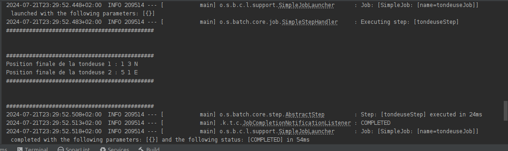

# Kata-Tondeuse
Kata Tondeuse implementation in Spring Batch | Java 17:

## Program Test: 
use mvn test 
or run /src/test/TestProgram.class
## Input file example: 
/src/main/resources/input.txt
## Output Example:

